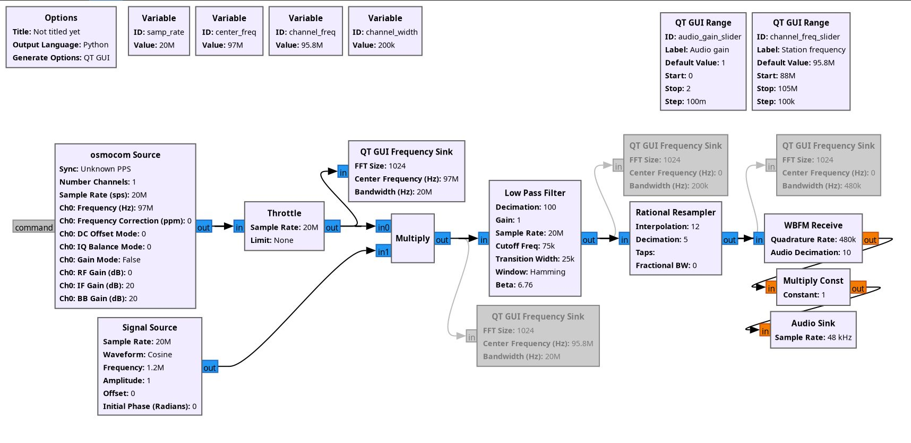

# Basic FM Reader and Decoder

This FM decoder is designed to receive a wideband radio signal using a HackRF One, isolate a specific FM station, demodulate it, and play the resulting audio.

Instead of tuning the SDR directly to each station, we capture a wide RF chunk (20 MHz) centered around a fixed frequency. Then, using a local oscillator, shift the desired station to baseband, making isolating a station with a low-pass filter possible. This method avoids reinitializing the HackRF One each time we switch stations.

## Flowgraph

### 1. RF Front-End

- **Osmocom Source** block receives raw IQ samples from HackRF with a sample rate of **20 MHz** centered at **97 Mhz** (`center_freq`)

*FM spectrum from 87 MHz to 107 MHz (97 MHz ± 20 MHz)*

- **Signal Source** generates a cosine wave which is used to tune to a specific station (`channel_freq`) with respect to a center frequency (`center_freq`). Cosine frequency is set to $\mathtt{center\_freq} - \mathtt{channel\_freq}$. By default, the station frequency is set to **95.8 MHz**, so the cosine frequency is set to **97 MHz** - **95.8 MHz** = **1.2 MHz**. This acts as a local oscillator

- **Multiply** block mixes the RF signal with the local oscillator, shifting the desired FM station to baseband (**0 Hz**). This works because multiplying by a cosine (or complex exponential) in the time domain is equivalent to shifting in the frequency domain.

*Station 95.8 MHz centered at baseband*

### 2. Filtering and Decimation

- **Low Pass Filter** isolates a single FM channel. Standard FM channels are **±100 kHz** wide, so we set a cutoff frequency to **75 kHz** and a transition width to **25 kHz**. 

    Decimation is applied after filtering in the same block to limit unnecessary CPU and memory usage because now we are focusing on a small portion of the FM spectrum. Decimation is set to **100**, meaning we take every 100th sample. Now our sample rate is **20 MHz** ÷ **100** = **200 kHz**

*Station spectrum after filtering and decimation*

### 3. Resampling and Demodulation

- **Rational Resampler** block adjusts the sample rate for demodulation by a rational number **12** / **5**. Typical audio sample rate is **48 kHz**, but the demodulator needs a much bigger sample rate, at least **2×** the original sample rate. An FM station occupies **~200 kHz**, so ideally we should resample to a number with the same ratio but large enough for a resampler, so we have **~2.4** × **200 kHz** = **480 kHz**

*Station spectrum after resampling*

- **WBFM Receive** block demodulates IQ samples into an audio signal and decimates it by **10**, which gives us the correct sample rate for audio playback: **480 kHz** ÷ **10** = **48 kHz**

### 4. Audio Output

- **Multiply Const** block scales the audio signal with a value of the volume slider

- **Audio Sink** block plays the demodulated and scaled FM station signal